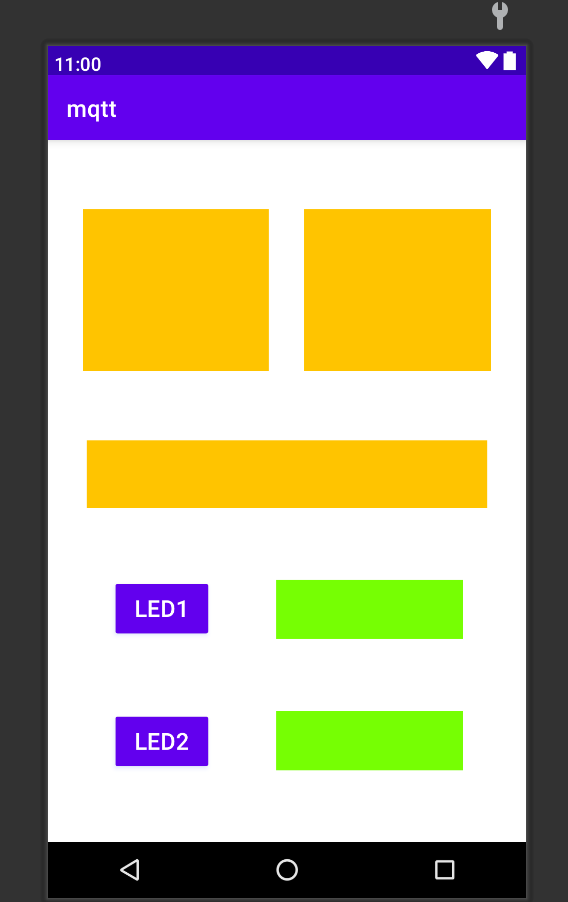

# Eclipse Mqtt Paho Android Client

## Overview:
    An example of an Android Application that using the mqtt.paho library
    fragments and data binding

The App is still in development

## Current Layout 

